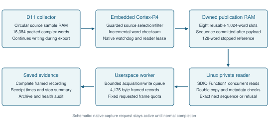
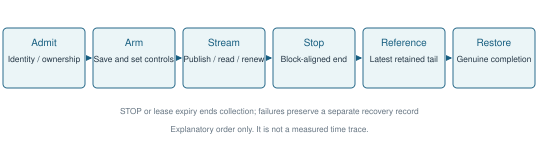
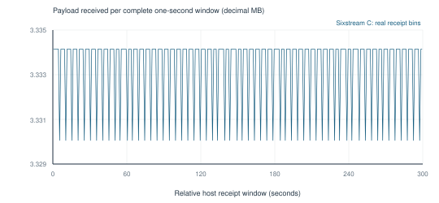
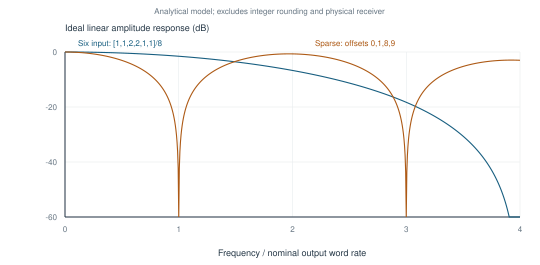
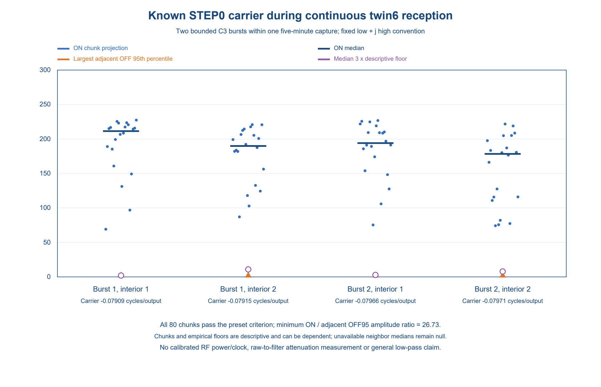

# Sustained Selected Complex Receive Streaming from the BCM43455 on Raspberry Pi 5

Technical report 0.3.0. Prepared 2026-10-06. Creators: Adam Davies. Original report and diagrams: CC BY 4.0; original code: GPL-2.0-or-later. Retained upstream terms apply separately.

## Abstract

We demonstrate a checked one-hour recording of selected radio receive samples from the Raspberry Pi 5's onboard BCM43455c0 Wi-Fi chip. Patched manufacturing firmware fills small buffers while a Linux driver reads them and one hardware collector remains active. In accepted recordings, every requested output passes sequence and checksum checks, with controlled stop and checks for stalled readers. The output intentionally retains selected or partly filtered samples at reduced rates, rather than exporting the complete input. In a separately audited five-minute STEP0 recording, two short known-source bursts produce detectable signals: all 80 predeclared test chunks pass. Included source and build instructions reproduce the exact tested firmware and driver bytes. These results establish one-hour bounded sample delivery, observed raw-position rollover and separate early and late source correlation. They do not establish complete-input physical continuity, calibrated RF bandwidth or comprehensive anti-alias filtering. The operational controller remains private, so the hardware experiment is not turnkey.

## 1 Purpose and scope

Normal Wi-Fi software exposes decoded packets. Time-domain receive samples let software examine the received waveform without requiring a decoded packet for each exported block. This project demonstrates an experimental radio-sample streaming capability using the Raspberry Pi 5's existing BCM43455c0 Wi-Fi chip, with an audited one-hour recording.

This project was inspired by ESP-SDR's sample access on Espressif chips, including its continuous streaming implementations. The Broadcom chip already contained a finite diagnostic sample-capture mechanism. Our contribution is adapting it into sustained, checked export to Linux on this particular chip and firmware, while the collector remains active and small buffers are reused. We establish no first-ever radio-sample-access claim. The [pinned comparison](../evidence/prior-art-comparison.csv) and section 9 identify inspected precedents.

The essential idea is to read small buffers before they are reused. Firmware takes completed values from the chip's circular sample memory and publishes blocks in a second reusable buffer. A Linux reader retrieves those blocks while collection continues. Sequence, checksum and lifecycle checks distinguish accepted delivery from an incomplete or failed recording.

The stream is intentionally reduced-rate. Ordinary capture produces nominally 20 million packed complex words per second; selecting one input position in sixteen gives nominally 1.25 million output words per second. Other tested configurations combine several inputs before selection and deliver nominally about 833,333 output words per second. These differences express intentional selection or partial filtering, not transport loss.

A separate five-minute source demonstration records two short, bounded ESP32-C3 bursts, one near the start and one near the end. The later passive one-hour trial extends delivery validation and contains no deliberate source operation. All 80 predeclared STEP0 RF test chunks pass their fixed criteria. This supports early and late source correlation during one receiver session; the transmitter is not active for the full five minutes.

Access to radio samples and a practical general-purpose receiver require different evidence. Capture mode 17 is identified with the vendor-labelled rx_filt_1core receive path. Its exact ordering relative to all internal receive filters and corrections is uncharacterised; bare-ADC access is not established. The reduced-rate stream still needs comprehensive anti-alias filtering, calibrated tuning/bandwidth and continuous protocol decoding. Making it a practical general-purpose receiver is the next stage. Checked host sequences also do not independently locate every physical input sample time.

The evidence includes the original five-minute operating points, supporting shorter tests, later separately identified sparse32/twin6 trials and the separately audited ten-minute and one-hour passive follow-ups. [The public run registry](../evidence/runs.json) retains their configuration identities and aggregate results. This report summarises prior complete saved-archive audits and inspected implementation; publication preparation performs offline checks, not independent hardware replication. The individual experiments retain their own dates and identities. Included source rebuilds the exact tested firmware and driver bytes, but the private operational controller prevents turnkey repetition of the hardware experiment.

## 2 Hardware and firmware context

The tested hardware is Raspberry Pi 5 with BCM43455c0/CYW43455 onboard wireless silicon. Chip naming is retained for discovery; similarity of names does not imply compatibility between revisions or binaries. The experimental firmware is a patched manufacturing image identifying itself as 7.120.5.1 C0 WLTEST. It differs from the stock 7.45.265 firmware used for ordinary networking.

The accepted sustained baselines use numerical capture mode 17, core0, vendor downsamp=0 and a 20 MHz channel configuration on channel 40, nominally 5.200 GHz. The vendor label associates this mode with rx_filt_1core. Exact ordering relative to all receive corrections and filters is unresolved. Accordingly, the measured storage is described as packed complex receive samples, with no claim of bare-ADC access.

One 32-bit little-endian word stores two signed 16-bit lanes. The host reference convention assigns the low lane to the real component and the high lane to the imaginary component. Physical I/Q assignment and frequency sign are uncalibrated; an earlier finite Wi-Fi decoder used a conjugate convention. Sixteen-bit storage does not establish converter resolution or effective dynamic range.

Exact baseline firmware/driver identities and image-specific collector addresses are listed in [the implementation appendix](implementation-appendix.md), subsection A1. [The public run registry](../evidence/runs.json) records the separately tested configurations.

## 3 Concurrent collection and publication

The hardware collector writes cyclic sample memory. Firmware observes its writer pointer, checks completion and moving lag, and reads only the inputs required for each output. The initial baselines publish blocks of 1,024 words into an eight-slot owned-RAM ring. Later accepted sparse32/twin6 trials use thirty-two slots and a different single-payload reader contract, described separately below. The host retrieves committed slots while the synchronous capture request is still outstanding. A bounded userspace queue allows acquisition to overlap buffered filesystem writes.

Figure 1. Source-derived architecture. Collection, firmware consumption and host reading overlap; the original command returns its genuine completion after stop. Source sample memory and host publication RAM have distinct lifetimes and capacities.

Each output slot contains 32 bytes of metadata and a 4,096-byte payload. Its sequence is invalidated before reuse. Firmware writes payload and metadata, commits the publisher checksum, executes a memory barrier, commits the slot sequence, executes another barrier and advances the published sequence. It never asks the hardware sample producer to wait for a slow host consumer.

The initial checked double-copy Linux reader verifies the expected descriptor and exact next publication. It reads slot metadata, copies the payload twice, rereads metadata and accepts only unchanged metadata, identical copies, correct publisher checksum, expected sequence/index and zero slot flags. Data frames reach userspace through bounded partial reads. A slow reader that falls beyond the output ring's recoverable window receives an error rather than silent best-effort data.

The publisher checksum is a word-wise FNV recurrence over all 1,024 packed words. It is an integrity check, not a cryptographic freshness proof. Double reads expose unstable copies but cannot prove that the collector generated fresh RF information at every nominal sample time.

## 4 Processing and rate budget

The ordinary selected path reads one completed source word and advances sixteen positions per output. The six-input path reads six consecutive values and applies nested signed half-add operations independently to both lanes. Its ideal linear weights are [1,1,2,2,1,1]/8. Actual integer semantics include intermediate arithmetic rounding and are specified in the appendix.

For the accepted six-input channel-40 configuration, the full PHY1a7:1a6 pair changes from 0x19ce38e3 to 0x1ab55554 through native helpers. Earlier finite production measurements associate that setting with nominal 13.333333 million input words/s, approximately one third below ordinary production. The pair is admitted before mutation, checked at arm, retained through stop/reference and restored completely afterward. This association does not establish a universal meaning for those bits or an undocumented clock-tree model.

| Path | Nominal input words/s | Inputs read per output | Nominal output words/s | Sample payload MB/s |
|---|---:|---:|---:|---:|
| Ordinary selected | 20,000,000 | 1 | 1,250,000 | 5.000 |
| Modified six-input | 13,333,333.333 | 6 | 833,333.333 | 3.333 |

MB denotes 1,000,000 bytes. Exporting the complete ordinary 32-bit input would require 80 MB/s; the modified input would require approximately 53.333 MB/s. The historically observed four-bit 50 MHz DDR50 link has a 50 MB/s gross ceiling. That bus mode was not remeasured during Sixstream C, and gross capacity excludes protocol costs. [SD Association bus-speed overview](https://www.sdcard.org/developers/sd-standard-overview/bus-speed-default-speed-high-speed-uhs-sd-express/)

An exported userspace frame is 4,176 bytes: 4,096 payload bytes and 80 bytes of metadata/timing. The original V26/be069 checked SDIO path reads at least 8,384 data bytes per frame: 128 descriptor bytes, two 32-byte slot-metadata reads and two 4,096-byte payload reads. At the nominal six-input rate this is approximately 6.823 MB/s, before empty polls, lease updates, window accesses and bus overhead. Payload cadence is therefore not a maximum transport-capacity measurement.

The important acquisition limit is embedded sample-port and complete-loop service cost. The accepted six-input append distributes checksum accumulation across new words instead of rescanning a completed block at publication. It retains the 128-output batch cap and original timing/lag/ownership checks. Its maximum recorded batch cost is 20,338 counterticks; the exact maximum complete-loop duration is not exported. Copy-only budget calculations exclude other firmware work and are not total CPU-utilisation measurements.

## 5 Lifecycle and host control

The reader initializes an exact owned-RAM heartbeat. Firmware admits its initial token, observes expected modular token increments and services the existing nonzero native watchdog deadline. The heartbeat lease expires if renewal ceases; this is distinct from the native watchdog, which protects another part of firmware execution. Timer and pointer arithmetic use explicit modular rules rather than treating a counter wrap as ordinary increasing arithmetic.

Closing the selected stream can request STOP through one fixed owned-RAM word after identity and state checks. Firmware finishes an aligned publication block and returns through normal vendor cleanup. A separate stop summary verifies the idle descriptor, retained latest tail and stopped aperture. The producer can publish one intentional suffix block after the host's requested quota. That block is accounted for separately and need not have reached the host.

Figure 2. Explanatory lifecycle schematic, not a measured event trace. Native cleanup and completion occur after collection ends. The stopped reference uses the latest firmware-retained tail, which may belong to the intentional unread suffix.

A long capture through the earlier nl80211 control path could hold networking locks and stall unrelated progress. The accepted private module uses a privileged fixed capture endpoint outside that dispatch. It enrolls protocol-mutex users before queueing, admits one capture owner only when no users are pending, and refuses competing radio controls with EBUSY. The original command remains synchronous and its real completion reply is preserved. The data reader uses SDIO RAM access concurrently with that lifecycle.

In the original five-minute baselines, the host worker separates acquisition and recording with an 8,192-frame bounded queue, containing about 34.21 MB of frame bytes plus object overhead. The queue absorbs finite filesystem stalls; exhaustion still stops the experiment. Python buffering and kernel/storage caching mean a short write call is not evidence of durable storage completion. Host CPU, IRQ load and fsync latency were not systematically recorded.

## 6 Evaluation method and results

The prior audits bind tested image/module identities, frozen source packages, raw control exchanges, full frame recordings, sequence/checksum accounting, stop/reference, native restoration and retained health. The package exports allowlisted aggregates and relative receipt bins. Complete original RF and operational recordings remain private, as described in [data availability](../evidence/data-availability.md).

Publication preparation additionally reruns the new offline data-frame verifier on the complete Private long B, Sixstream C and Sparse A recordings: 614,848 frames containing 629,604,352 packed words. Every frame's sequence, metadata and publisher checksum passes, and file identities are recorded in [preparation checks](../evidence/preparation-checks.json). This repeats supplied-file integrity checking. It does not repeat the control-wire, restoration or hardware-health experiments; Lease C support remains its prior complete audit.

For F frames of N=1,024 words, delivered count is F*N. Cadence from first-to-last equivalent receipt markers uses (F-1)*N divided by their span. This is host delivery timing, not an independent physical capture duration. Expected requested counts come from fixed host quotas. Their agreement with nominal durations inferred from the same counts is not an independent continuity test.

| Run | Frames | Complex words | Host receipt span s | Approximate payload cadence MB/s |
|---|---:|---:|---:|---:|
| Private long B selected | 368,640 | 377,487,360 | 301.990723487 | 4.999973 |
| Sixstream C partial prefilter | 244,160 | 250,019,840 | 300.023884130 | 3.333319 |
| Lease C selected | 73,728 | 75,497,472 | 60.397535486 | about 5.000 |
| Sparse A short follow-up | 2,048 | 2,097,152 | 2.515536915 | about 3.333 |

The two five-minute configurations establish incremental delivery far beyond available on-chip storage. The collector remains active, the original capture command has not returned, eight publication slots are repeatedly reused, and checked frames arrive throughout the recording. Taken together, these observations rule out an explanation based solely on a large capture drained after completion.

Figure 3. Real Sixstream C userspace receipt data aggregated into 300 complete half-open one-second windows. Each bin contains 813 or 814 frames, corresponding to 3.330048 or 3.334144 MB of payload. The final partial window is excluded. This describes delivery scheduling, not calibrated RF timing.

Every requested frame sequence and publisher checksum passes the prior complete audits. Sixstream C has 244,160 delivered frames and 244,161 firmware blocks, including one unread suffix. Its maximum observed lag is 2,666 raw words, with 1,907 watchdog services and lease renewals. Its recording queue peaks at 93 of 8,192 frames. The exact full-loop maximum remains unexported; guard enforcement is supported by the reviewed implementation.

Private long B records all requested frames despite a 5.678687167-second blocking write. Its queue reaches 6,931 of 8,192 frames. This is evidence that the larger queue handled that particular stall, and a warning that finite buffering has limited reserve. The quieter Sixstream C queue behaviour does not establish the same headroom for every storage workload.

## 7 Limitations and validity

Validation applies to the exact tested firmware, driver, capture configuration and bounded workload. Watchdog service, reader renewal, publication ownership, lag bounds, exclusive control and a bounded host recording queue are part of the operating contract. Different workloads, storage conditions or longer operation need their own validation.

Healthy retention is assessed through recorded unchanged originals, loaded/selected driver identity, Ethernet and sensor responses, boot/service continuity and inactive recovery guards. It is a finite observation under the documented workload, not an unlimited reliability guarantee.

The firmware extends a modulo source pointer with sampling/timing constraints. Those checks can detect observed excessive lag, unstable clock/context or exceeded work bounds. An independent absolute sample-generation counter is absent. An unrecognised full lap or unmodelled collector pause cannot be excluded solely by a correct host sequence.

Earlier full-rate finite samples yield complete Wi-Fi frames with independent decoder and frame-check validation. A new offline replay independently recovers twelve complete 1 Mbps DBPSK frames from preserved channel-1 records; all twelve MAC checksums and frame residues pass, and all twelve deliberate one-bit corruption controls are rejected. This is an offline decoding result from those finite records, not a complete acquisition-session validation or a decoder for the reduced-rate continuous stream. It supports useful radio waveforms in the receive-tap family. It does not characterise every long-stream word or prove calibrated narrowband transfer. Controlled passband/blocker/alias tests and clock/gain/dynamic-range measurements remain separate research needs.

## 8 Partial filters and the sparse follow up

The six-input kernel reduces some high-frequency energy before stride16 but is a short partial prefilter. Its ideal model gives only weak rejection near the first folding band. A later strong host FIR can filter before a second decimation but cannot remove energy already folded into the wanted band by the first selection.

Figure 4. Analytical ideal linear responses against frequency divided by the nominal output rate. Integer rounding and the physical receiver are excluded. Sparse offsets 0,1,8,9 create odd-alias notches while leaving even-alias exposure. Mathematical zeros are not measured electrical rejection.

The independently audited sparse A follow-up uses four inputs at offsets 0,1,8,9 with signed nested averaging and the modified channel-1 production profile. Its 2,048 consecutive frames span 2.515536915 seconds. Mean active copy cost including incremental hash is 136.756814 counterticks/output, maximum batch copy 17,508 and maximum lag 2,600. Normal stop, full native pair restoration, 16 renewals and retained health pass. Separate stopped-cost epochs compare 3,072 outputs against 64,000 same-epoch raw words: 1,536 sparse-four and 1,536 six-input references. This is the combined count for that experiment.

This establishes short live feasibility, not five-minute reliability of the new filter/channel combination. The ideal sparse model improves one nearest-alias family but is worse for aggregate flat-white folding than six and leaves even aliases exposed.

A separate finite channel-1 comparison provides additional processing evidence. Its separate saved audit checks four OFF/STEP10/STEP10/OFF epochs, 64,000 raw words and all 3,072 signed-tree filter references with native control/selector restoration and retained health. The source produces multiple coherent products. Analysis jointly fits those products and DC, and retains the raw background and exact integer-floor error. Matched 256-output windows compare each kernel with the dense raw window from its own epoch.

| Source-linked ON epoch | Six attenuation dB | Sparse attenuation dB | Additional sparse attenuation dB |
|---|---:|---:|---:|
| 2 | 1.710 | 18.449 | 16.739 |
| 3 | 1.878 | 17.695 | 15.817 |

Both target frequencies are near -0.067092 cycles/input. Their nominal folded frequencies are about -61.23 kHz, outside the wanted +/-40 kHz band. These measurements establish bounded nearby-line software-filter attenuation at the recorded tap. They do not establish wanted-band alias rejection, a general receiver low-pass response, calibrated antenna gain or an absolute clock. The 128-output windows are prefixes of the 256-output windows, not independent repetitions. [Finite RF result registry](../evidence/rf-findings.json)

## 8a Later five-minute and selected-line follow-ups

These results use a separate ABI35/ABI36 thirty-two-slot owned-RAM ring and one payload copy with stable metadata and publisher checksum checks. The original eight-slot double-copy description is retained for its original operating points. A larger ring provides four times the publication retention; the changed reader reduces ordinary RAM transfer bytes by 48.85%. Because both changes were combined, the five-minute results do not isolate their individual causal benefit. Hardware sample-ring capacity and unobserved-lap limitations remain unchanged.

| Later trial | Complex words | Host receipt span s | Interpretation |
|---|---:|---:|---|
| Sparse32 A | 250,019,840 | 300.024784325 | Sparse-four, 32 slots, single payload copy |
| Twin6 five-minute A | 250,019,840 | 300.025637336 | Broader partial filter, same output rate |

Both deliver 244,160 consecutive frames with publisher checksums, normal STOP, one unread suffix, full native pair restoration, 128 newest-owned-tail references, 1,907 watchdog services/lease renewals and healthy retained operation. Their source identities and prior complete audits are selected explicitly in [the run registry](../evidence/runs.json). These preparation steps reuse those completed audits; they do not repeat their hardware or full recording checks.

The twin6 partial kernel takes offsets 0,1,2,8,9,10. Its ideal weights are [1,2,1,1,2,1]/8. Separate finite matched raw epochs validate all 3,072 signed references from 64,000 raw words. Two independently started source epochs measure an additional 3.332/4.683 dB selected-line reduction relative to sparse-four, compared with an ideal 4.538 dB. The selected folded line is near +0.23338 cycles/output, outside the wanted +/-0.048 region. These are modest but physically measured selected-line differences, not a general low-pass response or a measured white-noise improvement.

## 8b Five-minute known-signal demonstration

A new completed experiment retains the same twin6 b4b firmware, d437 module, ABI36 and 32-slot configuration. It delivers 244,160 checked frames containing 250,019,840 complex words over 300.025188989 host seconds, with normal STOP, one unread suffix, 128 newest-owned-tail reference words, full native pair restoration and 1,907 lease/watchdog services. The saved wire/frame/archive/health review passes. This AI-assisted saved-data review reused a parser derived from a separate audit implementation; it is not independent parser authorship or independent laboratory replication.

An ESP32-C3 emits two bounded STEP0 bursts around 10 and 277 seconds while that single collector remains active. The transmitter is normally off. This establishes early and late source correlation during the five-minute receiver session; it is not a continuously transmitting five-minute source or a claim that every output word contains that signal. No receiver gain change, firmware flash or capture restart separates these bursts.

The prospective primary frequency gate is [-0.13,-0.02] cycles/output. Four ON windows contain 20 nonoverlapping 16,384-word chunks each. All 80 chunks pass the unchanged criteria, including at least tenfold amplitude over matched adjacent OFF95, three counts and three descriptive floors, plus frequency stability. Each window exceeds the minimum 12 passing chunks. The smallest individual ON/OFF95 ratio is 26.733; the four median ratios are approximately 81.77, 76.23, 78.71 and 71.75. The selected frequency is near -0.079 cycles/output, outside the earlier wanted +/-0.048 region. This demonstrates a received source-linked line at this tap, not a calibrated wanted-band passband or additional filter attenuation. No dense raw reference is present in this recording.

Forty optional neighbor-median diagnostics are unavailable because all eligible neighbor projections were excluded near fitted nuisance lines. A strict-JSON supplement represents these as null, never zero, preserving the original NaN-bearing analysis and every RF estimate, criterion and pass flag. Operative quantities remain finite. The fallback conditional least-squares scales are descriptive: IID, stationarity and confidence coverage have not been validated. The result does not establish an empirical neighbor-floor estimate for all 80 chunks.

The [sanitized predeclared plan](../evidence/rf-step0/plan.json), [all 80 ON chunk fit values and matched OFF summaries](../evidence/rf-step0/fitted-values.json), and [frozen mathematical method and decision reproducer](../src/rf_step0/README.md) make the acceptance arithmetic inspectable. The standard-library reproducer recalculates chunk decisions, frequency stability and the minimum 26.733026989053336 ON/OFF95 ratio. OFF95 percentiles are supplied bound summaries; individual OFF fit rows were not retained in the selected response. This public check does not refit withheld waveforms, recompute those OFF percentiles or repeat source timing, capture integrity or hardware-health validation.

Figure 5. Reviewed aggregate source-linked amplitude/frequency plot from the two bounded STEP0 bursts. OFF controls and preset acceptance remain distinct from model-dependent descriptive floors. This contains no original waveform samples.

Saved Pi host monotonic timestamps put the first userspace frame 6.931463 ms after reader arm and 6.515833 ms after the private query starts. Maximum userspace interframe gap is 1.458134 ms; STOP to genuine vendor completion is 2.122691 ms. These are host acquisition/transport latencies, not RF propagation delay, ADC timing or a calibrated radio clock. The latency supplement does not repeat the full saved-frame audit. [Known-signal aggregates](../evidence/known-signal-findings.json)

## 8c Longer passive twin6 recordings and counter rollover

The accepted ten-minute ABI36 follow-up delivers 488,320 checked frames containing 500,039,680 complex words over 600.051726406 host seconds, using b4b firmware/d437 driver. The separate accepted ABI37 one-hour follow-up delivers 2,929,920 checked frames containing 3,000,238,080 complex words over 3600.316538804 host seconds, using the coherent-read 58a firmware and matching 44c driver. Both retain thirty-two publication slots, the same twin6/native1.5 filter leaf and the timing, ownership, lag, reader-renewed lease, watchdog and normal STOP guards. The ABI37 change concerns bounded clock-read coherence and first-failure evidence, not filter or transfer performance.

ABI37 uses a bounded coherent clock read and retains diagnostic state for a rejected reading. Saved observations witness one clock high-word advance during the hour. They do not establish whether the bounded retry branch executed.

Full saved-file/frame, wire, normal STOP, paired-control restoration, newest 128 stopped-tail, archive and retained-health audits pass for each run. The hour records 22890 native watchdog services and 22890 reader renewals; its initial-plus-renewed heartbeat is 22891. Its complete payload sequence and publisher checksums pass. The two trials are passive, with no new known-source burst or protocol decode on their reduced-rate output. The historical source demonstration in section 8b remains a separate five-minute RF result.

The raw-position metadata crosses the uint32 boundary once in the ten-minute recording and 11 times in the hour recording. The audit reconstructs bounded positive modular differences and checks the terminal position against selected output count and the full reported ring-wrap/pointer position. This establishes the observed rollover under the native bounded-progress contract; it does not independently exclude unobserved whole source-ring laps or calibrate sample time. The hour's 3,000,238,080 selected words exceed signed32 range while remaining below unsigned32 rollover. Selected-word-counter rollover is therefore a separate, untested boundary.

One accepted hour is a longer tested operating point, not unlimited reliability or a systematic CPU/storage stress result. No original ambient waveform, operational controller, private network detail or decoded payload is added to the public package. [Long-duration and finite-reception aggregates](../evidence/longrun-findings.json)

## 9 Related work and reproducibility

Pinned primary-source comparison distinguishes the contribution from existing work. Nexmon SDR commit 70733afc documents arbitrary time-domain transmission, while Nexmon CSI commit 1232edf2 explicitly supports Pi 5 per-frame frequency-domain CSI. Pair-Fi commit 26d57310 documents finite BCM4389c1 raw reception followed by on-chip decoding. ESP-SDR commit fb264f96 documents continuous filtered S3 streaming and S31 DMA/ring ownership. Its continuous S3 PR 4 merged 2 October 2026 at 17:10:43 UTC. Continuous Wi-Fi-chip reception, generic reusable rings and integrity checks are therefore established ideas. We make no broad first-device, first-Pi5, priority or head-to-head performance claim. The bounded comparison concerns this exact BCM43455c0 selected-output implementation, private control lifecycle and measured operating points. Commit timestamps alone do not prove first public disclosure. [Pinned comparison and line witnesses](../evidence/prior-art-comparison.csv), [ESP-SDR PR 4](https://github.com/ESPARGOS/esp-sdr/pull/4), [Nexmon CSI Pi5 discussion](https://github.com/seemoo-lab/nexmon_csi/discussions/395)

The historical source recipe at src/device reproduces the tested ABI36 b4b image and complete d437 module. The separate ABI37 recipe at src/device-abi37 reproduces the complete 652,800-byte 58a image and 656,600-byte 44c driver module with the documented pinned inputs and toolchains. The fresh unprivileged standalone build matches the full module SHA and all 45 allocated/relocation sections; it installs nothing. Native ELF debug and symbol bytes can differ with paths even when the composed image is exact. These are software-build results; the acquisition and recovery controller remains private. [Historical source guide](../src/device/BUILD.md), [ABI37 source guide](../src/device-abi37/BUILD.md).

Manufacturer binaries and original ambient I/Q remain excluded. The tested full acquisition controller depends on private freshness, installation, recovery and health records and is withheld. The protocol, inspected mechanism, frame verifier and integration prerequisites are available; the hardware experiment is not turnkey. Public readers can reproduce the source builds, synthetic checks, aggregate calculations and available figures, but cannot repeat the complete historical wire/health/payload audit or run the full experiment from this package alone. The owner selected GPL-2.0-or-later for original code and CC BY 4.0 for the original report and diagrams. Existing upstream terms remain applicable. See [licence grants and exclusions](../LICENSING.md).

The findings are supported by saved experiment evidence and source-bound analysis, with extensive AI assistance. Human contributions and AI assistance are described in the accompanying contribution statement. No external hardware replication or peer-review status is claimed.

## 10 Conclusion and continuing disclosure

The demonstrated achievement is experimental radio-sample streaming from the Pi 5's existing Wi-Fi chip, with a checked one-hour recording. It shares ESP-SDR's broad aim of making receive waveforms available to software. The specific contribution here is sustained, checked BCM43455c0 export from an existing diagnostic capture mechanism; a practical general-purpose receiver remains a further research stage.

The accepted implementation delivers sustained selected complex receive output from one active BCM43455c0 collector, with checked reusable-memory publication and concurrent SDIO host retrieval. The original and later five-minute results establish separately bounded operating points for selected and partially filtered export. The later ten-minute and one-hour passive audits extend duration and observed counter-rollover validation, with signal characterisation evaluated separately. Finite raw epochs show modest additional selected-line attenuation for twin6. The STEP0 recording demonstrates two known-source bursts during a separately checked five-minute stream. Exact firmware and module rebuilding strengthens implementation reproducibility without providing a turnkey hardware controller. Complete-input acquisition continuity, calibrated RF performance and comprehensive anti-alias filtering remain open.

This report is intended as useful technical disclosure and a foundation for further research. Its purpose includes an accessible dated record for prior-art consideration, without a guarantee about future patents or third-party rights. Its eventual public date will be recorded when enabling content actually becomes available. [UK novelty provisions](https://www.gov.uk/guidance/the-patent-act-1977/section-2-novelty), [EPO enabling-disclosure guidance](https://www.epo.org/en/legal/guidelines-epc/2026/g_iv_2.html)

The working overview can evolve throughout the research. Each released snapshot retains its files, evidence cutoff and actual public-availability record. New teaching, corrections and additional experiments receive their own dated version. A DOI identifies that record and does not certify technical correctness or novelty. [Zenodo versioning](https://help.zenodo.org/docs/deposit/manage-versions/)

## References and evidence

- [Public run registry and exact tested identities](../evidence/runs.json), derived from the retained complete audits named there.
- [Claim evidence table](../evidence/claims.csv), linking report propositions to public artifacts and stated limits.
- [Available receipt bins](../evidence/derived/sixstream-c-delivery.json), derived from real userspace timestamps.
- [Implementation appendix](implementation-appendix.md), extracted from inspected firmware/driver semantics.
- Matthias Schulz, Daniel Wegemer and Matthias Hollick. Nexmon: The C-based Firmware Patching Framework, 2017. [Project](https://nexmon.org).
- Francesco Gringoli, Matthias Schulz, Jakob Link and Matthias Hollick. Free Your CSI: A Channel State Information Extraction Platform For Modern Wi-Fi Chipsets, WiNTECH 2019. [DOI](https://doi.org/10.1145/3349623.3355477).
- SEEMOO. Nexmon software-defined radio project, MobiSys 2018 repository. [Source](https://github.com/seemoo-lab/mobisys2018_nexmon_software_defined_radio).
- ESPARGOS and contributors. ESP-SDR repository and continuous-I/Q documentation, retrieved 5 October 2026. [Source](https://github.com/ESPARGOS/esp-sdr).
- SD Association. Bus speed overview, retrieved 5 October 2026. [Source](https://www.sdcard.org/developers/sd-standard-overview/bus-speed-default-speed-high-speed-uhs-sd-express/).

Exact historical experiment/source hashes are retained in the private provenance inventory and public run registry. The pinned primary-source comparison records bounded inspected precedents; it is not an exhaustive literature search or a novelty certification.
